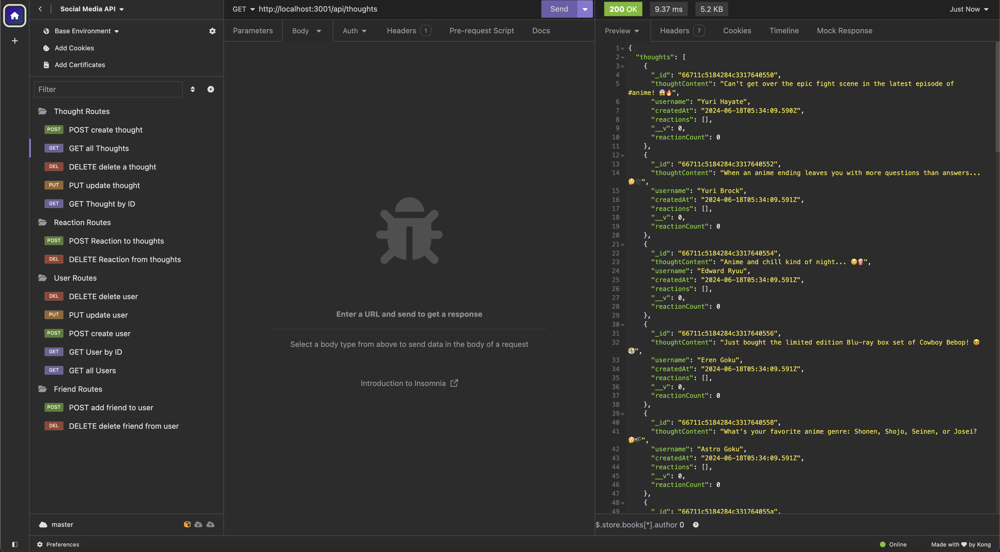

# Social Media API

## Motivation

This project was motivated by the need to create a robust and scalable social media API that can handle complex data relationships.

## Why This Was Built

This was built to provide a backend solution for social media applications, handling operations related to users, thoughts, and reactions.

## What It Solved

This project solved the challenge of managing and manipulating complex data in a social media context, including creating, reading, updating, and deleting data.

## What I Learned

Through this project, I learned how to use Express.js for routing, Mongoose for data modeling, and MongoDB as a NoSQL database.

## Table of Contents

- [Features](#features)
- [How to Use](#how-to-use)
- [Usage](#usage)
- [Technologies Used](#technologies-used)
- [Local Development](#local-development)
- [Deployment Link](#deployment-link)
- [Credits & Resources](#credits--resources)
- [License](#license)

## Features

- User, Thought, and Reaction models
- CRUD operations for each model
- Friend connections between users

## How to Use

1. Clone the repository.
2. Run `npm install` to install dependencies.
3. Use `npm run seed` to seed the database with initial data.
4. Start the server with `npm start`.

## Usage

## Technologies Used

- Node.js
- Express.js
- MongoDB
- Mongoose

## Local Development

To set up this project locally for development:

1. Clone this repository.
2. Install Node.js and MongoDB on your machine.
3. Run `npm install` in the project directory.
4. Use `npm run seed` to seed the database with initial data.
5. Start the server with `npm start`.

## Demonstration Link

[Click here to go to demonstration video](https://www.youtube.com/playlist?list=PLFdFJhnaZBE8fbRqcqKcyoU7GPtuI24RG)

## Credits & Resources

- [Express.js Documentation](https://expressjs.com/)
- [Mongoose Documentation](https://mongoosejs.com/)
- [MongoDB Documentation](https://docs.mongodb.com/)

## License

This project is open source and available under the [ISC License](LICENSE).
